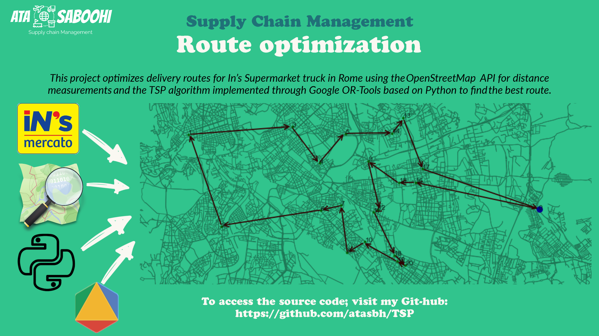

# In's Supermarket route optimization with TSP method

This project pertains to the optimization of delivery routes for In's Supermarket truck in Rome. The objective is to identify the shortest path for the truck to transport goods from the depot to the delivery destination and subsequently return to the depot. The OpenStreetMap API is utilized to obtain accurate distance measurements between the relevant locations, and the TSP algorithm, implemented through Google OR-Tools, is employed to determine the optimal route.
